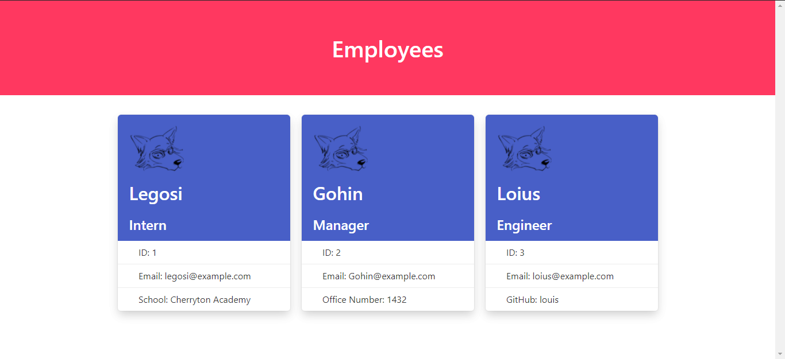

# Employee Manager
Url to this repository: https://github.com/LifeInvaderr/Employee-Manager

## Description
With Employee Manager, the user is able to create ID cards for their employees through a series of questions.

## Table of Contents
* [Installation](#installation)
* [Usage](#usage)
* [Tests](#tests)
* [Questions](#questions)

## Installation
To install this file, either clone or install a zip version of this file. Once installed, be sure to npm install to initialize the needed files.

## Usage
With this program, you are able to create an HTML file for each employee you add through a series of prompts. In which you could display their info

## Tests
To test the program, be ensure that you have entered npm install as to install the neccessary files for this program. Once that is done, enter npm start to initialize the program.

Once the program is finished, be sure to check in the /dist directory for the printed files.

## Questions
For any questions or concerns, please email me at matthewkausfox@gmail.com

Thank you.